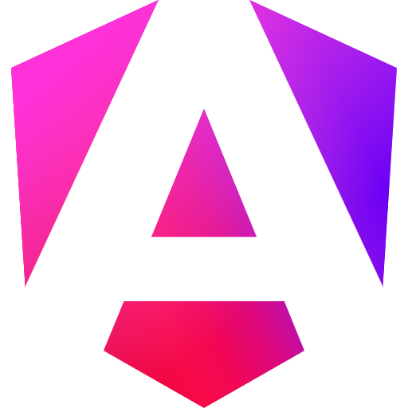

---
# try also 'default' to start simple
theme: seriph
# random image from a curated Unsplash collection by Anthony
# like them? see https://unsplash.com/collections/94734566/slidev
background:

fonts:
  sans: "DM Sans"
  serif: "DM Sans"
  weights: "300,600"
# some information about your slides (markdown enabled)
title: Os 5 ingredientes que temperam a internet
info: |
  ## Slidev Starter Template
  Presentation slides for developers.

  Learn more at [Sli.dev](https://sli.dev)
# apply UnoCSS classes to the current slide
class: text-center
# https://sli.dev/features/drawing
drawings:
  persist: false
# slide transition: https://sli.dev/guide/animations.html#slide-transitions
transition: slide-left
# enable MDC Syntax: https://sli.dev/features/mdc
mdc: true
---

  
🧂 Os 5 ingredientes   que temperam  a internet.

<!--   

    
    
  
 -->

  

---

  

    
Sobre Mim

  

  
  

    

      
    

  

    

      🏡 Cristão, moro em Juiz de Fora - MG;
    

    

      🤖 Apaixonado por tecnologia e desenvolvimento de software.  Tenho mais de 7 anos na área de T.I sendo 4 como desenvolvedor;
    

    

      🧟‍♂️ Rock e terror são meus gêneros de música e filme favoritos;
    

    

      ⚫️ Black theme >>>> light theme;
    

  

  

  

  
  

---

  

    
Linha do Tempo do Front-end

  

  

    
  

      

      

        

      

      

        
Anos 90

        
HTML, CSS e JavaScript nascem

        
(fundação da web)

      

  

    
  

      

      

        

      

      

        
2000s

        
AJAX, jQuery e a Web 2.0

        
(páginas dinâmicas e interativas)

      

  

    
  

      

      

        

      

      

        
2010s

        
SPAs, React, Vue, Angular, Node.js

        
(era dos frameworks e componentes)

      

  

    
  

      

      

        

      

      

        
2020s

        
Performance, SSR/SSG, DX, IA

        
(apps rápidos, server-first e automação inteligente)

      

    

    
  

  
  

    
  

---

  

    
Como tudo isso se mantém de pé?!

  

  

  

  
  

---

  

    A resposta é...
  

  

  
  

---

  

  

    Não sei!
  

  

    👍
  

  

  

  
  

---

  

    Fim.
  

  

  
  

---

  

    
Brincadeira!

  

  

  

  
  

---

  

    
P-A-D-R-O-N-I-Z-A-Ç-Ã-O

  

  

  

  
  

---

Os 5 ingredientes 🧂

  

    <duo-icons-fire class="text-2xl" />
   1 - Cultura
  

  

    <duo-icons-dashboard class="text-2xl" />
   2 - Arquitetura
  

  

    <duo-icons-brush class="text-2xl" />
   3 - Ferramentas
  

  

    <duo-icons-campground class="text-2xl" />
   4 - Comunidade
  

  

    <duo-icons-book-2 class="text-2xl" />
   5 - Documentação
  

  

---

  
Cultura

  
Base de tudo. Se o time não valoriza padrões, nada se sustenta!

  

    
🚩 Na prática: TODOS precisam seguir o padrão que foi proposto.

    
🤩 Benefícios: consistência e previsibilidade, independentemente de quem escrever o código.

  
☠️ Quando a cultura é fraca ou não existe:   - “jeitinhos” viram norma, gerando dívidas técnicas e bugs;
    - Cada um trabalha do seu jeito;
  

  

  

  

---

  
Arquitetura

  
Gambiarra não escala!

  

    
🚩 Na prática: definir uma estrutura clara de pastas, camadas e responsabilidades.

    
🤩 Benefícios: UI isolada da lógica, componentes bem definidos, regras de negócio centralizadas em serviços ou use cases.

  
☠️ Quando a arquitetura é fraca ou não existe: 
    - Dependências circulares e difíceis de resolver;
    - Funcionalidades novas quebram partes antigas;
    - O time sente medo de mexer porque tudo pode dar ruim;
  

  

  

  

---

  
Ferramentas

  
Ferramentas são um meio, não um fim nelas mesmo!

  

    
🚩 Na prática: ferramentas e stacks que trouxeram um impacto positivo no nosso trabalho e no código. O objetivo não é adotar ferramentas por modismo, a escolha deve sempre estar alinhada à nossa cultura e arquitetura. 

    
🤩 Benefícios: facilita o fluxo de trabalho, automatiza processos e reduz erros humanos. 

  
☠️ Quando se escolhe mal a ferramenta/stack: 
    - Código deprecado;
    - Baixa performance da aplicação;
    - Alta curva de aprendizagem;
  

  

  

  

---

  
Comunidade

  
Nós escrevemos código para outros humanos. No fim, as máquinas só entendem 0 e 1!

  

    
🚩 Na prática: criar espaços onde podemos nos ajudar, propor, discutir e atualizar padrões . 

    
🤩 Benefícios: engajamento do time e padrões que refletem a realidade, trocas de conhecimento e aprendizagem. 

  
☠️ Quando não se tem um senso de comunidade: 
    - Cresce a sensação de "falta de direção" no time;
    - Cada dev toma decisões isoladas;
    - Novos devs não sabem "o que é combinado";
  

  

  

  

---

  
Documentação

  
2h de debugging podem ser evitadas com 40min de documentação!

  

    
🚩 Na prática: manter guias atualizados e acessíveis, de fácil consulta. 

    
🤩 Benefícios: novos devs se integram rápido, decisões técnicas são claras e ninguém precisa ficar perdido sem entender o que faz determinada feature. 

  
☠️ Quando não se tem um senso de comunidade: 
    - Conhecimento fica na cabeça de poucas pessoas;
    - Quando alguém sai, o time perde contexto crítico;
    - Novos devs demoram muito para se adaptar;
    - Padrões se perdem e cada um inventa o seu jeito;
  

  

  

  

---

  

    
Dúvidas, dicas ou contribuições?

  

  

  

  
  

---

  

    Obrigado!🤙
  

  

  
  

